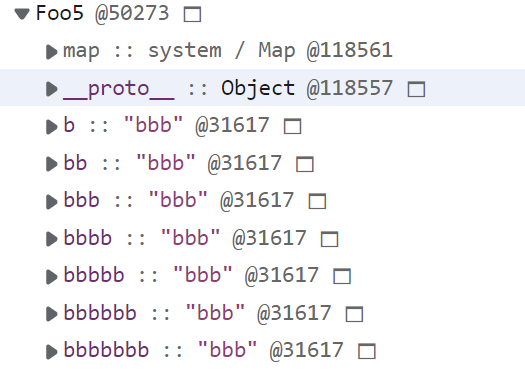
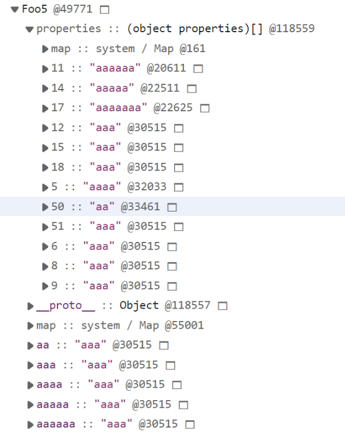
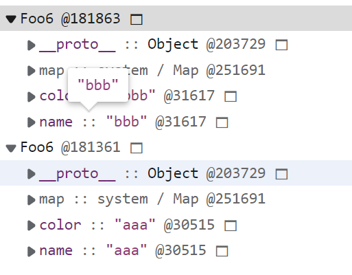

# V8中对象的结构

在V8中，对象由三个指针构成，分别是`隐藏类(Hidden Class)`——用于描述对象的结构、`Property`——存放对象的命名属性、`Element`——存放对象的可索引属性
根据 [ECMA规范](https://tc39.es/ecma262/#sec-ordinaryownpropertykeys) 要求，可索引属性应该按照索引值大小升序排列，而命名属性根据创建的顺序升序排列

```js
var a = { 1: "a", 2: "b", "first": 1, 3: "c", "second": 2 }

var b = { "second": 2, 1: "a", 3: "c", 2: "b", "first": 1 }

console.log(a) 
// { 1: "a", 2: "b", 3: "c", first: 1, second: 2 }

console.log(b)
// { 1: "a", 2: "b", 3: "c", second: 2, first: 1 }
```

在同时使用可索引属性和命名属性的情况下，两种不同属性之间存在明显的分离

## 命名属性的存储方式

命名属性有三种不同的存储方式：对象内属性(in-object)、快属性和慢属性

- 对象内属性保存在对象本身，提供最快的访问速度
- 快属性比对象内属性多了一次寻址时间
- 慢属性与前面两种属性相比，会将属性的完整结构存储(另外两种属性的结构会在隐藏类中描述)，速度最慢
前两者通过线型查找进行访问，慢属性通过哈希存储的方式进行访问

## 隐藏类

JS是一门动态编程语言，它允许开发者使用非常灵活的方式定义对象，对象可以在运行时改变类型，添加或删除属性
为了提高对象的访问速度，实现对象的快速读取
隐藏类的引入，也可以节省内存空间
在ECMA中，对象属性的Attribute被描述为以下结构：

- **[Value]**：属性的值
- **[Writable]**：定义属性是否可写
- **[Enumerable]**：定义属性是否可枚举
- **[Configurable]**：定义属性是否可配置

隐藏类的引入，将Value与其他Attribute区分开，一般情况下，对象属性的value是会经常变动的，而其他Attribute是不会经常变动的
在对象的创建过程中，每添加一个命名属性，都会生成一个对应的新的隐藏类，在V8底层实现了一个将隐藏类连接起来的转换树，如果从相同的起点，以相同的顺序，添加架构相同的属性(除value外，属性是Attribute相同)，就会生成相同的隐藏类

## delete操作

```js
// 实验5 delete 操作的影响
function Foo5 () {}
var a = new Foo5()
var b = new Foo5()

for (var i = 1; i < 8; i ++) {
  a[new Array(i+1).join('a')] = 'aaa'
  b[new Array(i+1).join('b')] = 'bbb'
}

delete a.a
```




从图中可以看到a和b两个对象中的属性，本身都是对象内属性
在a对象使用了delete方法删除了一个属性后，a对象中的属性变回了慢属性，退回了哈希存储
但是，如果按照添加的顺序逆向删除属性，情况会有所不同

```js
// 实验6 按添加顺序删除属性
function Foo6 () {}
var a = new Foo6()
var b = new Foo6()

a.name = 'aaa'
a.color= 'aaa'
a.text = 'aaa'

b.name = 'bbb'
b.color = 'bbb'

delete a.text
```


此时，可以看到，a和b的隐藏类相同，a也没有退回哈希存储

所以，总是以形同的顺序初始化对象能充分利用相同的隐藏类，进而提高性能
增加或删除可索引属性，不会引起隐藏类的变化，稀疏的可索引属性会退化为哈希存储
delete 操作可能会改变对象的结构，导致引擎将对象的存储方式降级为哈希存储，不利于V8的优化，应尽可能避免使用，但是当沿着属性添加的顺序反方向删除属性时，对象不会退化为哈希存储

## 参考文档

[V8 是怎么跑起来的 —— V8 中的对象表示](https://www.cnblogs.com/chargeworld/p/12236848.html)
