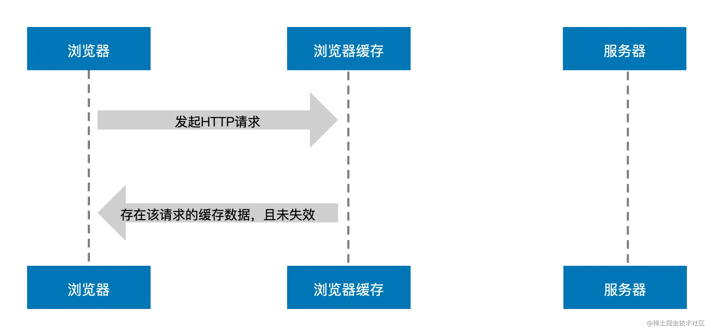

前端缓存如果按照**失效策略**划分，可以分为：

- 强缓存
- 协商缓存
强缓存和协商缓存也可以称为HTTP缓存

如果按照**缓存位置**划分可以分为：

- Service Worker Cache
- Memory Cache
- Disk Cache
- Push Cache

前端缓存还有存储型缓存：

- Cookie
- Web Storage
- IndexedDB

还有一些本质上来说不属于前端的缓存技术：

- DNS缓存
- CDN缓存

# HTTP缓存


1. 浏览器每次发起请求，都会先在浏览器缓存中查找该请求的结果以及缓存标识，如果不存在该缓存结果和缓存标识，强制缓存失败，则直接向服务器发起请求
2. 第一次请求成功，浏览器从服务器下载资源文件，并缓存资源文件与缓存标识，以供下次加载时对比使用
3. 下一次加载资源时，由于强制缓存优先级较高，先比较当前时间与上一次返回200时的时间差，如果没有超过cache-control设置的max-age，则没有过期，并命中强缓存，直接从本地读取资源。如果浏览器不支持HTTP1.1，则使用expires头判断是否过期
4. 如果资源已过期，则表明强制缓存没有被命中，则开始协商缓存，向服务器发送带有lf-None-Match 和lf-Modified-Since的请求
5. 服务器收到请求后，优先根据Etag 的值判断被请求的文件有没有做修改，Etag值一致则没有修改，命中协商缓存，返回304；如果不一致则有改动，直接返回新的资源文件带上新的Etag值并返回200
6. 如果服务器收到的请求没有 Etag 值，则将lf-Modified-Since和被请求文件的最后修改时间做比对，一致则命中协商缓存，返回304；不一致则返回新的last-modified和文件并返回200

## 强缓存




当浏览器向服务器发起请求时，服务器会将缓存规则放入HTTP响应报文的HTTP头中和请求结果一起返回给浏览器，控制强缓存的字段分别是expires和cache-control

### Expires

Expires是HTTP/1.0控制网页缓存的字段，其值为缓存过期的绝对时间，如果客户端的时间小于Expires的值时，直接使用缓存结果
到了HTTP/1.1，Expire已经被Cache-Control替代，原因在于Expires控制缓存的原理是使用客户端的时间与服务端返回的时间做对比，那么如果客户端与服务端的时间因为某些原因（例如时区不同；客户端和服务端有一方的时间不准确）发生误差，那么强制缓存则会直接失效，这样的话强制缓存的存在则毫无意义

### Cache-Control

在HTTP/1.1中，Cache-Control是最重要的规则，主要用于控制网页缓存，主要取值为：

- **public**：该资源可以被任何节点缓存，包括服务端和代理服务器
- **private**：所有内容只有客户端可以缓存，代理服务器不会缓存，**Cache-Control的默认取值**，如果同时设置了private和s-maxage，s-maxage将会被忽略
- **no-cache**：在请求和响应中都可以用，在请求头中使用时，表示告知代理服务器不直接使用缓存，要求向源服务器发送请求，而当在响应头中被返回时，表示客户端可以进行缓存，但每次使用缓存前需要先向服务器确认缓存的有效性
- **no-store**：在响应头中使用时，表示不进行任何的缓存
- **max-age=xxx (xxx is numeric)**：缓存过期的绝对时间，优先级高于expires，两者尝尝同时出现，为了向下兼容，同时该字段还可在请求头中使用，告知服务器客户端希望接收一个存在时间不大于多少秒的资源
- **s-maxage**：作用和max-age类似，但是只适用于公共缓存服务器，也就是代理服务器，在代理服务器中s-maxage的优先级高于max-age

由于Cache-Control的优先级比expires，那么直接根据Cache-Control的值进行缓存，意思就是说在600秒内再次发起该请求，则会直接使用缓存结果，强制缓存生效。注：在无法确定客户端的时间是否与服务端的时间同步的情况下，Cache-Control相比于expires是更好的选择，所以同时存在时，只有Cache-Control生效

但是Cache-Control中的max-age属性依旧会收到本地时间的影响，可以简单理解为强缓存也是存在保质期的
> 强缓存是否过期 = 缓存保质期 > 缓存使用期

缓存保质期指的就是max-age的值，如果max-age的值不存在，就会选择expires，保质期就是(expires - date)，data表示创建报文的时间，可以理解为服务器返回资源的时间，用过期时间（expires）减去创建时间（date）就可以计算出浏览器真实的缓存时间

缓存使用时间可以理解为浏览器已经使用该缓存的时间，主要包括响应时间+传输延迟时间+停留缓存时间，响应时间可以使用响应头中的age字段表示，可以理解为源服务器在多久前创建了响应，停留缓存时间表示资源在浏览器上已经缓存的时间，而修改本地时间，就会影响到缓存的停留时间，因为缓存的停留时间是用电脑的当前时间减去浏览器收到响应的时间

强缓存会在第一次请求的时候，将请求资源缓存在disk cache中，也就是硬盘缓存，第二次请求的时候就会直接从缓存中读取资源，就会减少页面响应的时间，如果在不关闭tab的情况下，刷新几次页面，浏览器就会将部分使用频率高的资源放入memory cache中，也就是内存缓存，memory cache的响应时间比disk cache更快，所以页面的响应时间就会更短

## 协商缓存

协商缓存需要在服务器端对比资源是否修改，来判断是否可以使用缓存。若未改动，则返回304状态码，浏览器拿到此状态码就可以直接使用缓存数据了。如果资源发生了改动，则返回修改过后的资源

协商缓存的前提是强缓存失效，但是强缓存失效并不一定导致浏览器启用协商缓存


### Last-Modified/If-Modified-Since

服务器通过在响应头中添加**Last-Modified**属性来指出资源最后一次修改的时间
当浏览器下一次发起请求时，会在请求头中添加一个**lf-Modified-Since**的属性，属性值为上一次资源返回时的**Last-Modified**的值
当请求发送到服务器后，服务器会通过这个属性来和资源的最后一次的修改时间来进行比较，以此来判断资源是否做了修改

- 如果资源没有修改，那么返回304状态，让客户端使用本地的缓存
- 如果资源已经被修改了，则返回修改后的资源
使用这种方法有一个缺点，就是**Last-Modified**标注的最后修改时间只能精确到秒级，如果某些文件在1秒钟以内，被修改多次的话，那么文件已将改变了但是**Last-Modified**却没有改变，这样会造成缓存命中的不准确

### Etag/If-None-Match

因为Last-Modified的这种可能发生的不准确性，http中提供了另外一种方式，那就是**Etag**属性
服务器在返回资源的时候，在头信息中添加了**Etag**属性，这个属性是资源生成的唯一标识符，当资源发生改变的时候，这个值也会发生改变
在下一次资源请求时，浏览器会在请求头中添加一个**lf-None-Match**属性，这个属性的值就是上次返回的资源的**Etag**的值。服务接收到请求后会根据这个值来和资源当前的**Etag**的值来进行比较，以此来判断资源是否发生改变，是否需要返回资源。这种方式比Last-Modified的方式更加精确

当Last-Modified和Etag属性同时出现的时候，Etag 的优先级更高。使用协商缓存的时候，服务器需要考虑负载平衡的问题，因此多个服务器上资源的Last-Modified应该保持一致，因为每个服务器上Etag 的值都不一样，因此在考虑负载平衡时，最好不要设置Etag属性，只要有这两个标识之一，在强缓存失效后浏览器便会携带它们向服务器发起请求

其中 if-modified-since 对应 last-modified 的值，if-none-match 对应 eTag 的值。服务器根据优先级高的缓存标识的值进行判断

## 启发式缓存策略

缓存新鲜度 = max-age || (expires - date)
如果响应头中没有max-age和expires，也就相当于缺少了强缓存的必要字段时，浏览器依旧会走强缓存

```js
date: Thu, 02 Sep 2021 13:28:56 GMT
age: 10467792
cache-control: public
last-modified: Mon, 26 Apr 2021 09:56:06 GMT
```

当响应头中没有强缓存所必须的两个字段的时候，将会触发浏览器的启发式缓存，启发式缓存的缓存新鲜度计算如下：
> 缓存新鲜度 = max(0,(data - last-modified))*10%
根据响应头中data与last-modified值之差与0取最大值后取其值的百分之十作为缓存的时间

如果浏览器在此发请求的间隔时间小于缓存新鲜度的时间，浏览器依旧会返回200，走强缓存策略

## 总结强缓存与协商缓存

强缓存策略和协商缓存策略在缓存命中时都会直接使用本地的缓存副本，区别只在于协商缓存会先向服务器发送一次请求。它们缓存不命中时，都会向服务器发送请求来获取资源。在实际的缓存机制中，强缓存策略和协商缓存策略是一起合作使用的。浏览器首先会根据请求的信息判断，强缓存是否命中，如果命中则直接使用资源。如果不命中则根据头信息向服务器发起请求，使用协商缓存，如果协商缓存命中的话，则服务器不返回资源，浏览器直接使用本地资源的副本，如果协商缓存不命中，则浏览器返回最新的资源给浏览器

## 浏览器缓存的优点

浏览器缓存指的是浏览器将用户请求过的静态资源，存储到电脑中，当浏览器再次访问时，直接从本地加载，不需要再去服务端请求了

- 减少了服务器的负担，提高了网站的性能
- 加快了客户端网页的加载速度
- 减少了多余的网络数据传输
- 减少了请求次数

## 浏览器的行为模式

- 地址栏输入地址——查找disk cache中是否匹配，如果有则使用，如果没有，就发送网络请求
- 正常重新加载——点击刷新或F5：优先读取memory cache，其次是disk cache，最后发送网络请求
- 硬性重新加载——Ctrl+F5(强制刷新)：硬性重新加载会禁用缓存，使用硬性重新加载后的资源的请求头上都加上了cache-control：nocache和prama：no-cache，两者的的作用都是告知服务器不直接使用缓存，要求向源服务器发起请求
  - 但是硬性重新加载也会有例外的时候，硬性重新加载只是禁用了缓存，并没有删除本地存储的缓存，当使用硬性重新加载时，随着页面渲染的资源依旧会命中缓存，而等待页面加载完成后通过异步脚本插入到DOM中的资源是不走缓存的
  - 除此之外，base64图片也会命中缓存，几乎永远都是from memory cache，因为本质上base64图片就是一堆字符串，随着页面的渲染而加载，浏览器对其解析会损耗一定的性能，所以浏览器会将其塞入memory cache以节省开销
- 清空缓存并硬性重新加载——该操作会将浏览器存储的本地缓存都清空掉后重新向服务器发起请求，所有访问过的网站混村都将被清除

# 缓存位置

## memory cache

内存缓存，存储在浏览器内存中的，其优点为获取速度快，优先级高，缺点是生命周期短，当网页关闭后内存就会释放，也受制于计算机内存的大小

## disk cache

磁盘缓存，存储在计算机硬盘中的一种缓存，优点是声明周期长，不触发删除操作则一直存在，缺点是获取的速度相比内存缓存来说比较慢
disk cache会根据保存下来的资源的http首部字段来判断他们是否需要重新请求，如果重新请求那便是强缓存失效流程，否则便是生效流程

# 浏览器的缓存机制

## 缓存获取顺序

按照缓存顺序来说，当一个资源准备加载时，浏览器会根据其三级缓存原理进行判断

1. 浏览器会率先查找内存中的缓存，如果资源在内存中存在，那么直接从内存中加载
2. 如果内存中没找到，便会去磁盘中查找，找到便从磁盘中获取
3. 如果磁盘中也没找到，那么就进行网络请求，并将请求后的资源存入内存和磁盘中
按照以上顺序，浏览器缓存与HTTP缓存才得以相辅相成，减少了不必要的资源浪费

## 缓存存储优先级

1. ServiceWorker 缓存：ServiceWorker 检查资源是否存在其缓存中，并根据其编程的缓存策略决定是否返回资源。这个操作不会自动发生，需要在注册的 ServiceWorker 中定义 fetch 事件去拦截并处理网络请求，这样才能命中 ServiceWorker 缓存而不是网络或者 HTTP 缓存（[浏览器知识查漏补缺——Web Work](https://github.com/Sunnnnnnnnnnnny/Blog/issues/19#issue-1342752195)）
2. HTTP 缓存：这里就是我们常常说的「强缓存」和「协商缓存」，如果 HTTP 缓存未过期的话，浏览器就会使用 HTTP 缓存的资源
3. 服务器端：如果 ServiceWorker 缓存或者 HTTP 缓存中未找到任何资源，则浏览器会向网络请求资源。这里就会涉及到 CDN 服务或者源服务的工作了

当进入页面的时候，除了base64的图片永远从内存中加载，其他大部分资源会从disk cache中加载

当刷新页面的时候，有部分资源会从disk cache变为memory cache

可以看出，css文件一般会存放在disk cache中，因为css文件加载一次就可渲染出来，页面不会频繁的读取css文件，所以css文件不适合存放在memory cache中，js文件有的会在disk cache中，有的会在memory cache中，原因可能是因为某些js资源加载的时候浏览器的渲染进程还没有结束，而进程没有结束就有被存入memory cache中，所以在浏览器内存缓存生效的前提下，js资源加载的时间会影响其是否被内存缓存

### Preload和Prefetch

preload 也被称为预加载，其用于 link 标签中，可以指明哪些资源是在页面加载完成后即刻需要的，浏览器会在主渲染机制介入前预先加载这些资源，并不阻塞页面的初步渲染。例如：

```js
<link rel="preload" href="https://i.snssdk.com/slardar/sdk.js" as="script" />
```

而当使用 preload 预加载资源后，笔者发现该资源一直会从磁盘缓存中读取，JS、CSS 及图片资源都有同样的表现，这主要还是和资源的渲染时机有关，在渲染机制还没有介入前的资源加载不会被内存缓存

相反 prefetch 则表示预提取，告诉浏览器加载下一页面可能会用到的资源，浏览器会利用空闲状态进行下载并将资源存储到缓存中

```js
<link rel="prefetch" href="https://i.snssdk.com/slardar/sdk.js" />
```

使用 prefetch 加载的资源，刷新页面时大概率会从磁盘缓存中读取，如果跳转到使用它的页面，则直接会从磁盘中加载该资源

# 存储型缓存

[浏览器存储](Blog-master\浏览器相关\浏览器存储.md)

# 服务器缓存

## DNS缓存

[浏览器网络——DNS解析](https://github.com/Sunnnnnnnnnnnny/Blog/issues/22#issue-1345486994)

## CDN缓存

[性能优化——CDN](https://github.com/Sunnnnnnnnnnnny/Blog/issues/21#issue-1345484623)

# 参考文章

[前端浏览器缓存知识梳理](https://juejin.cn/post/6947936223126093861)
[一文读懂前端缓存](https://juejin.cn/post/6844903747357769742)
[ServiceWorker 缓存与 HTTP 缓存](https://juejin.cn/post/7088741970696208414)
