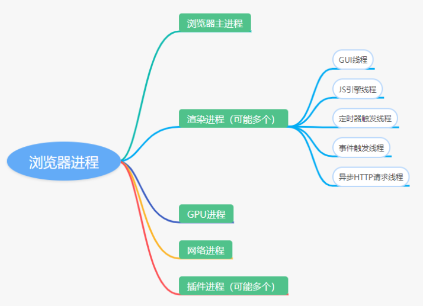
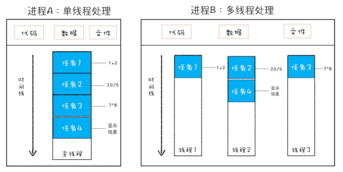
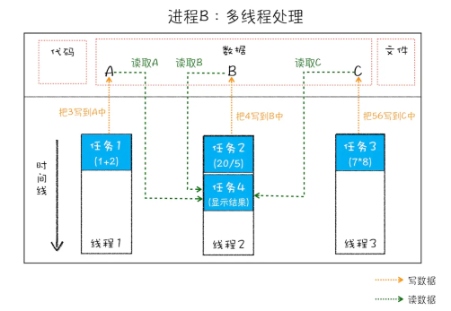

# 浏览器的进程与线程

最新的 Chrome 浏览器包括：1 个浏览器（Browser）主进程、1 个 GPU 进程、1 个网络（NetWork）进程、多个渲染进程和多个插件进程

**浏览器进程** —— 主要负责界面显示、用户交互、子进程管理，同时提供存储等功能

**渲染进程** —— 核心任务是将 HTML、CSS 和 JavaScript 转换为用户可以与之交互的网页，排版引擎 Blink 和 JavaScript 引擎 V8 都是运行在该进程中，默认情况下，Chrome 会为每个 Tab 标签创建一个渲染进程，里面包含多个线程，比如JavaScript的V8引擎。因为渲染进程所有的内容都是通过网络获取的，会存在一些恶意代码利用浏览器漏洞对系统进行攻击，所以运行在渲染进程里的代码是不被信任的，所以浏览器中的渲染进程会运行在安全沙箱里，就是为了保证系统安全

- **Compositor Thread合成线程** ——这是第一个被告知vsync事件的线程（这是操作系统告诉浏览器创建新帧的方式）
  - —— **Compositor Thread** 还将接收任何输入事件。如果可以的话，**Compositor Thread** 将避免进入 **Main Thread** ，并尝试将输入（例如滚动）转换为屏幕上的移动。它将通过更新层位置并通过GPU线程直接将帧提交到GPU来实现。如果由于输入事件处理程序或其他可视化工作而无法执行此操作，则需要将工作提交给 **Main Thread** 这个线程既负责接收浏览器传来的垂直同步信号(Vsync，水平同步表示画出一行屏幕线，垂直同步就表示从屏幕顶部到底部的绘制已经完成，指示着前一帧的结束，和新一帧的开始)， 也负责接收OS传来的用户交互，比如滚动、输入、点击、鼠标移动等等。
  - —— 如果可能，**Compositor Thread** 会直接负责处理这些输入，然后转换为对layer的位移和处理，并将新的帧直接commit到GPU Thread，从而直接输出新的页面。否则，比如你在滚动、输入事件等等上注册了回调，又或者当前页面中有动画等情况，那么这个时候Compositor Thread便会唤醒Main Thread，让后者去执行JS、完成重绘、重排等过程，产出新的纹理，然后Compositor Thread再进行相关纹理的commit至GPU Thread，完成输出。可以看到Compositor Thread是一个很核心的东西，后面的俩线程都是由他主要进行控制的
  - —— 同时，用户输入是直接进入 **Compositor Thread** 的，一方面在那些不需要执行JS或者没有CSS动画、不重绘等的场景时，可以直接对用户输入进行处理和响应，而Main Thread是有很复杂的任务流程的。这使得浏览器可以快速响应用户的滚动、打字等等输入，完全不用进主线程。这里也有一个非常重要的点，后文会说。再者，即使你注册了UI交互的回调，进了主线程，或者主线程很卡，但是因为Compositor Thread在他外面拦着，所以Compositor Thread依然可以直接负责将下一帧输出到页面上，因此即使你的主线程可能执行着高耗任务，超过16ms，但是你在滚动页面时浏览器还是能做出响应的（同步AJAX等特殊任务除外），所以比如你有一个比较卡的动画（动画的预先计算过程或者重绘过程超过16ms每帧），但是你滚动页面是非常流畅的，也就是动画卡而滚动不卡（[随便给你个demo自己试试看](https://link.juejin.cn?target=http%3A%2F%2Fcodepen.io%2FSitePoint%2Fpen%2FWQVxQQ%2F)）

- **主线程** —— 包含JS引擎和渲染引擎，负责渲染页面，解析HTML、CSS、构建DOM树、布局和绘制等，GUI引擎和JS引擎是互斥的，当JS引擎执行时GUI引擎会被挂起，GUI更新会被保存在一个队列中等到JS引擎空闲时立即被执行

- **Compositor Tile Worker(s)** ——（光栅化线程池？）可能有一个或多个线程，比如PC端的chrome是2个或4个，安卓和safari为1个或2个不等。是由Compositor Thread创建的，专门用来处理tile的Rasterization（前文说过的光栅化）
- **WebWorker线程** —— 创建Worker时，主线程向浏览器申请开一个子线程（子线程是浏览器开的，完全受主线程控制，而且不能操作DOM），主线程与worker线程间通过特定的方式通信（postMessage API，需要通过序列化对象来与线程交互特定的数据），如果有非常耗时的工作，会单独开一个Worker线程，worker线程不会影响JS引擎主线程， 只待计算出结果后，将结果通信给主线程即可
- **事件触发线程** —— 归属于浏览器而不是JS引擎，用来控制事件循环，当对应的事件符合触发条件被触发时，该线程会把事件添加到待处理队列的队尾，等待JS引擎的处理，注意，由于JS的单线程关系，所以这些待处理队列中的事件都得排队等待JS引擎处理
- **定时器触发线程** —— 浏览器定时计数器并不是由JavaScript引擎计数的，因为JavaScript引擎是单线程的, 如果处于阻塞线程状态就会影响记计时的准确，因此通过单独线程来计时并触发定时，计时完毕后，添加到事件队列中，等待JS引擎空闲后执行（注意，W3C在HTML标准中规定，规定要求setTimeout中低于4ms的时间间隔算为4ms）
- **异步HTTP请求线程** —— 在XMLHttpRequest在连接后是通过浏览器新开一个线程请求，将检测到状态变更时，如果设置有回调函数，异步线程就**产生状态变更事件**，将这个回调再放入事件队列中。再由JavaScript引擎执行

**GPU 进程** —— 其实，Chrome 刚开始发布的时候是没有 GPU 进程的。而 GPU 的使用初衷是为了实现 3D CSS 的效果，只是随后网页、Chrome 的 UI 界面都选择采用 GPU 来绘制，这使得 GPU 成为浏览器普遍的需求。最后，Chrome 在其多进程架构上也引入了 GPU 进程

**网络进程** —— 主要负责页面的网络资源加载，之前是作为一个模块运行在浏览器进程里面的，直至最近才独立出来，成为一个单独的进程

**插件进程** —— 主要是负责插件的运行，因插件易崩溃，所以需要通过插件进程来隔离，以保证插件进程崩溃不会对浏览器和页面造成影响
虽然多进程模型提升了浏览器的稳定性、流畅性和安全性，但同样不可避免地带来了一些问题：

- 更高的资源占用。因为每个进程都会包含公共基础结构的副本（如 JavaScript 运行环境），这就意味着浏览器会消耗更多的内存资源
- 更复杂的体系架构。浏览器各模块之间耦合性高、扩展性差等问题，会导致现在的架构已经很难适应新的需求了

## 进程与线程

一个程序至少有一个进程，一个进程至少有一个线程，线程的划分尺度小于进程，使得多线程程序的并发性高，线程不能脱离进程独立运行，线程越多意味着同时运行的任务越多
**进程是浏览器分配资源的最小单位，进程的最小单位是线程**
进程在执行过程中拥有独立的内存单元，而多个线程共享内存，从而极大的提高了程序的运行效率
每个独立的线程有一个程序运行的入口，顺序执行序列和程序的出口，但是线程不能够独立执行，必须依存在应用程序中，由应用程序提供多个线程执行控制
**从逻辑上看，多线程的意义在于一个应用程序中，有多个执行部分可以同时执行，但操作系统并没有将多个线程看做是多个独立的应用来实现进程的调度和管理以及资源分配，这就是进程和线程的重要区别**
线程是不能单独存在的，它是由进程来启动和管理的
一个进程就是一个程序的运行实例。详细解释就是，启动一个程序的时候，操作系统会为该程序创建一块内存，用来存放代码、运行中的数据和一个执行任务的主线程，我们把这样的一个运行环境叫进程

**总结来说，进程和线程之间的关系有以下 4 个特点**
1、进程中的任意一线程执行出错，都会导致整个进程的崩溃(所以JS线程执行报错时导致整个渲染进程停止工作)
2、线程之间共享进程中的数据

3、当一个进程关闭之后，操作系统会回收进程所占用的内存
当一个进程退出时，操作系统会回收该进程所申请的所有资源；即使其中任意线程因为操作不当导致内存泄漏，当进程退出时，这些内存也会被正确回收

1. 进程之间的内容相互隔离
进程隔离是为保护操作系统中进程互不干扰的技术，每一个进程只能访问自己占有的数据，也就避免出现进程 A 写入数据到进程 B 的情况。正是因为进程之间的数据是严格隔离的，所以一个进程如果崩溃了，或者挂起了，是不会影响到其他进程的。如果进程之间需要进行数据的通信，这时候，就需要使用用于进程间通信（IPC）的机制了
